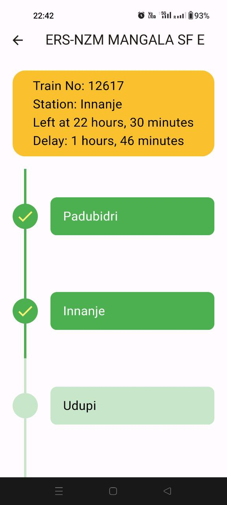
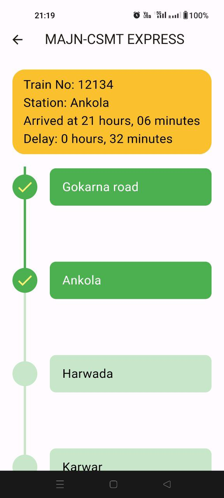
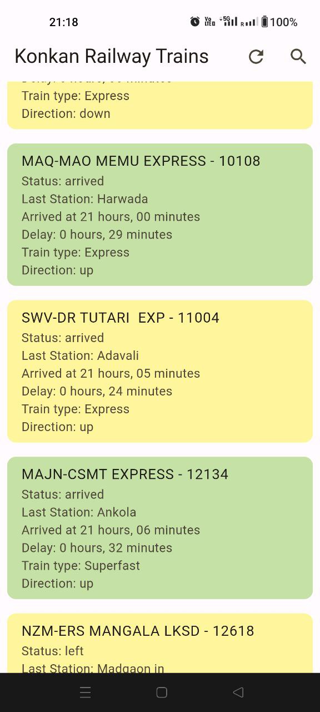
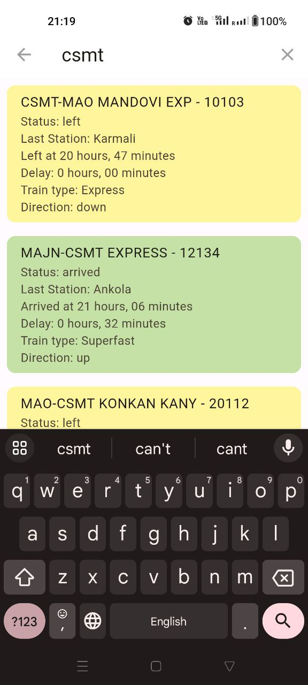
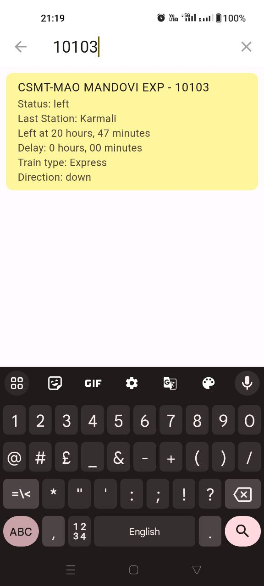

# Konkan Rail Train Status

A flutter application for displaying the current status of trains in the Konkan Railway jurisdiction.

API used: [Konkan Railway API](https://github.com/sibi361/konkan-railway_api)

## Sample Images
<p align="center">
  
  
  
  
  
</p>

## Install, build and run!
To clone and run this application, you'll need [Git](https://git-scm.com) installed on your computer. From your command line:

```bash
# Clone this repository
$ git clone https://github.com/04ac/konkan-rail-train-status

# Go into the repository
$ cd konkan-rail-train-status
```

Download Android Studio or Visual Studio Code with Flutter editor plugins. After that, open the project and install dependencies from ```pubspec.yaml``` by running the following command:
```bash
$ flutter pub get
```
## Built With

This software was built using the following:

- [Flutter](https://flutter.dev/)
- [Dart](https://dart.dev/)
- [Visual Studio Code](https://code.visualstudio.com/)


## Legal
This GitHub repository is not associated with any railway or other company/organization, including Indian Railways. It is an entirely independent project created solely for educational purposes.